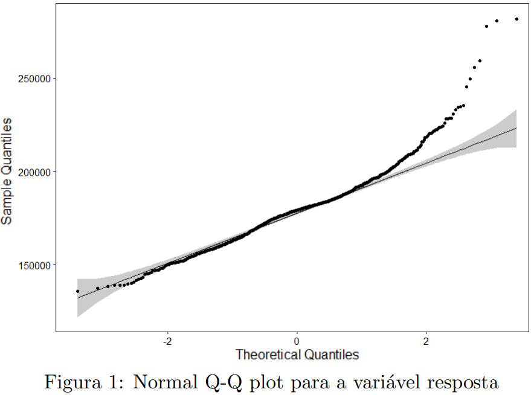
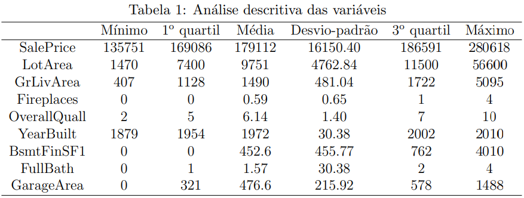
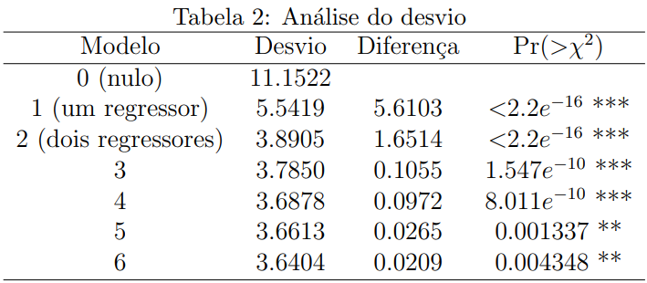
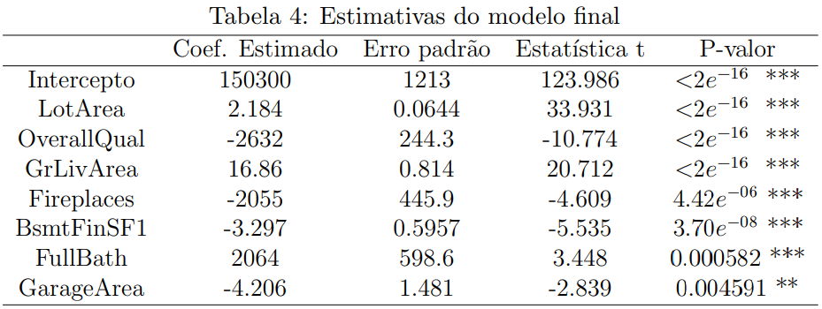
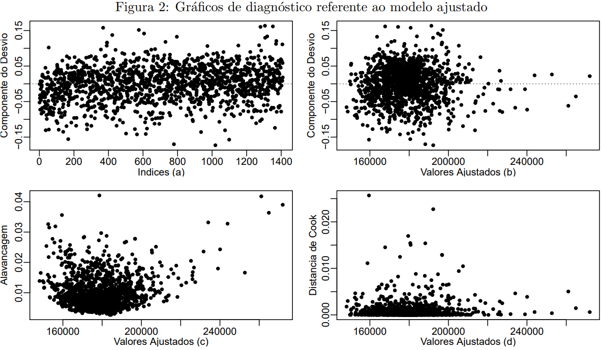
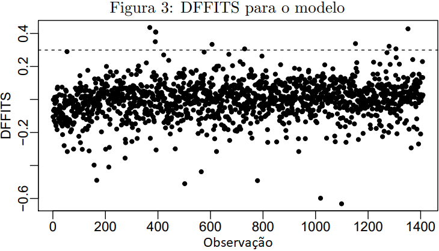
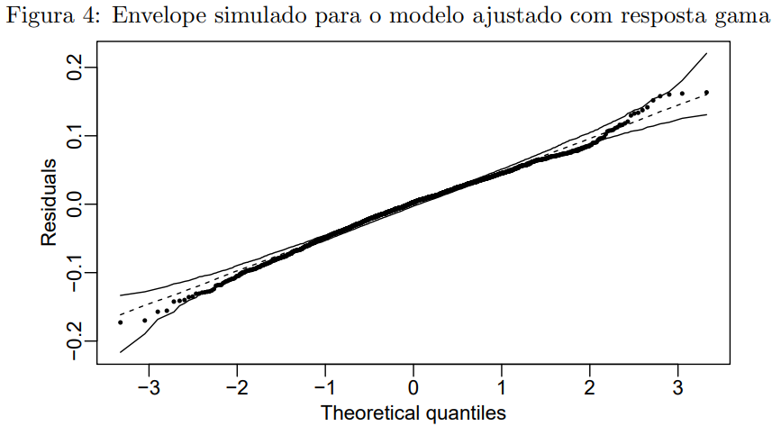
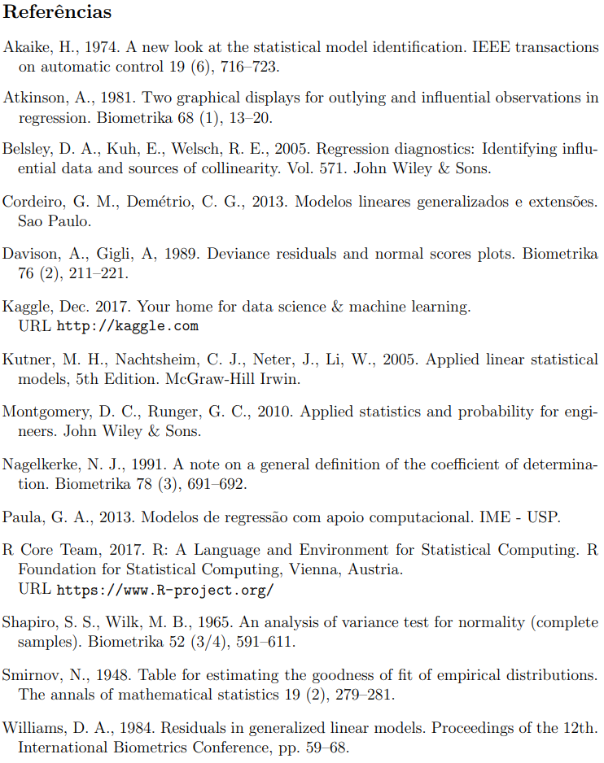

## Modelagem do preço de venda de imóveis dos Estados Unidos
##### Objetiva-se ajustar um modelo linear generalizado (MLG) para descrever o preço de venda de residências (em doláres) através da relação com variáveis independentes. Os dados foram obtidos do [Kaggle](https://www.kaggle.com/) de um escritório de impostos na cidade de Ames - Estados Unidos. Para validação do modelo proposto, da distribuição gama assumida para a variável resposta e da função de ligação identidade utilizada foram realizados testes estatísticos, análises de diagnóstico e influência. Os resultados demonstraram bom comportamento dos resíduos, adequação da função de ligação e boa qualidade no ajuste do modelo. 

### 1. Introdução
A análise de preços de imóveis mostra-se de grande utilidade para gerar informações relevantes que definem a tomada de decisão. Além disso, é importante conhecer o potencial de venda do imóvel. 
O principal questionamento "Como e o que considerar para avaliar o valor de um imóvel?" pode ser melhor compreendido e quantificável através de um modelo estatístico. É possível explicar a relação do preço do imóvel com alguns fatores e analisar os mais influentes. Por exemplo, queremos saber se localização e/ou tamanho de uma casa estão fortemente relacionados com o preço da mesma. Podemos considerar inúmeras variáveis em um modelo estatístico e por meio de uma seleção, verificar o que for estatisticamente significante.

Um modelo estatístico objetiva de maneira geral, a representação da realidade de forma simplificada. Estamos em busca de descrever algum fenômeno ou evento de interesse denominado variável resposta/dependente $Y$ em função de um conjunto de variáveis explicativas/independentes $X_i$,  seja para tomada de decisão, previsão ou explicação. Com isso, o efeito de $X_i$ sobre $Y$ pode ser expresso através de um modelo matemático. A escolha do modelo adequado se dá pela avaliação do modo como $X_i$ se relaciona com $Y$, da natureza dos dados, das variáveis, de pressuposições e de um diagnóstico confirmatório.

Quando a média de uma distribuição estatística não é constante, ou seja, quando o comportamento da variável de interesse é influenciada por outras variáveis, comumente utiliza-se modelos de regressão. Em particular, a regressão linear é amplamente utilizada sob condição de normalidade da variável resposta. O não cumprimento deste requisito, possibilita o uso de uma classe de modelos mais ampla e flexível, se $Y$ pertencer à família de distribuições exponencial: os modelos lineares generalizados (MLGs). 
Conforme Paula (2013), a flexibilidade dos MLGs se dá pela relação funcional entre a média de $Y$ e o preditor linear $\eta$ que pode ser arbitrado pela função de ligação garantindo que a média da variável não tenha valores fora do seu espaço paramétrico. Outra vantagem seria a diversidade de distribuições que estão inclusas à família exponencial como normal, binomial, exponencial, Poisson, gama e normal inversa, gerando mais opções para a distribuição da variável resposta.

### 2. Modelo Linear Generalizado

Os MLGs são compostos por:
1. Componente aleatório, representado por um conjunto de variáveis aleatórias independentes  $Y_1, ..., Y_n$, as quais provém de uma distribuição pertence à família exponencial na forma canônica com médias: $E(Y_i)= \mu_i$, ~ $i=1,2, ..., n$ ;
2. Componente sistemático, constituído da soma linear dos efeitos de variáveis independentes: $\eta_i= \mathbf{x_i^T \beta}$;
3. Função de ligação $g(\cdot)$, que relaciona os dois itens citados acima, ou seja, a média de $Y$ com $\eta_i$ o preditor linear: $g(\mu_i)=\eta_i$.

 
Portanto, consideramos uma estrutura de regressão para representar os MLGs:

$$ \eta_i = \sum^k_{j=1}  X_{ij} \beta_j = g(\mu_i),$$

em que $g(\cdot)$ é uma função de ligação, $\mathbf{\beta_j}$ são os parâmetros do modelo, $\mathbf{X_j}$ são as covariáveis e $\mathbf{\eta}$ é o preditor linear. É importante declarar que há vantagens se a função de ligação for escolhida de tal forma que $g(\mu_i)=\theta_i=\eta_i$, o preditor linear modela diretamente o parâmetro canônico $\theta_i$, e é chamada de função de ligação canônica.

A seleção de modelos é deve ser realizada de tal forma que o modelo seja simples e que explique bem a relação entre as variáveis explicativas e a resposta, ou seja, um modelo parcimonioso. As três principais escolhas para realizar um MLG são: A definição da distribuição da variável resposta $Y$ seguida pela matriz de regressores do modelo $X$ e por fim a escolha da função de ligação. Há procedimentos  que auxiliam a seleção de modelos de regressão por meio de critérios de seleção.

A estimação dos parâmetros do modelo pode ser realizada por vários métodos. Os estimadores de máxima verossimilhança são amplamente utilizados na literatura. Cordeiro e Demétrio (2013) reafirmam que o mesmo possui ótimas propriedades, como consistência e eficiência assintótica.
Quando não há uma solução fechada para os estimadores são considerados métodos numéricos como o de Newton-Raphson para obtenção da estimativa de máxima verossimilhança.

### 3. Descrição dos dados

O banco de dados foi obtido diretamente do site [Kaggle](https://www.kaggle.com/), que coletou as informações de um escritório de impostos na cidade de Ames, Estados Unidos. Os dados contam com 79 variáveis e uma amostra de 1460 observações, ou seja, 1460 residências que foram avaliadas de 2006 a 2010 para cálculo dos valores das propriedades residenciais vendidas. A variável resposta em estudo é o preço de venda das casas (**SalePrice**). Realizamos uma modelagem em $Y$ com informações sobre diversos fatores das casas sendo candidatas a inclusão as seguintes variáveis explicativas:

* **LotArea**: Tamanho do lote em pés quadrados ou \textit{square feet}*;
* **OverallQual**: Classifica (1 a 10) o material e acabamento da casa;
* **YearBuilt}**: Ano de construção da casa;
* **BsmtQual**: Avalia a altura do porão entre
  + **Ex**: Excelente ($100+$ polegadas)
  + **Gd**: Bom (90-99 polegadas)
  + **Ta**: Típico (80-89 polegadas)
  + **Fa**: Razoável (70-79 polegadas
  + **Po**: Ruim ($<70$ polegadas)
* **BsmtFinSF1**: Área do porão finalizada;
* **GrLivArea**: Tamanho da área de lazer em pés quadrados;
* **OpenPorchSF**: Tamanho da área da varanda em pés quadrados;
* **Fireplaces**: Quantidade de lareiras;
* **GarageArea**: Área da garagem em pés quadrados;
* **FullBath**: Quantidade de banheiros;
* **KitchenQual**: Avalia a qualidade da cozinha entre
  + **Ex**: Excelente
  + **Gd**: Bom 
  + **Ta**: Típico
  + **Fa**: Razoável
  + **Po**: Ruim
* **Neighborhood**: Bairros de Ames;
* **OverallCond**: Classifica (1 a 10) a condição da casa;

O padrão das casas dos EUA se diferencia das casas brasileiras. Por exemplo, a grande maioria das casas americanas tem um porão (basement), ou melhor, um primeiro andar no subsolo da casa, portanto é relevante considerar no modelo. 

Duas variáveis contidas no modelo são qualitativas, o que demandou o uso de variáveis
dummies. Conforme Montgomery e Runger (2010), quando uma variável qualitativa possui mais de dois valores, se faz necessário o uso de mais de uma variável Dummy, sendo que uma variável com $t$ níveis pode ser modelada com $t-1$ variáveis.

### 4. Metodologia

#### 4.1 Distruibuição
A variável resposta apresenta característica contínua limitada aos reais positivos e assimetria. A escolha da distribuição é feita com base na natureza dos dados e intervalo de variação. 
Inicialmente, testamos se a mesma provém de uma população que apresenta uma distribuição normal. Como método visual, realizou-se o Q-Q Plot (Figura 1) onde os quantis do conjunto de dados é comparado com os quantis teóricos normais. Pontos em linha reta indicam alta correlação entre o modelo teórico e os dados assumindo normalidade, fato não ocorrido nesta ocasião. 

  

Testes paramétricos podem ser realizados para testar normalidade de uma variável. Os usuais são de Shapiro-Wilk (1965) e Kolmogorov-Smirnov (1948)  com as seguintes hipóteses:

$$
\begin{cases}
H_0: \text{os dados seguem uma distribuição normal}; \\
H_0: \text{os dados não seguem uma distribuição normal}. \\
\end{cases}
$$

Analisando a variável resposta preço das casas obteve-se para os dois testes mencionados p-valor $<0,05$. Portanto, a hipótese nula é rejeitada ao nível de 5\% de significância e conclui-se que há evidências de que os dados testados não provém de uma população normalmente distribuída. Deve-se esclarecer que esses testes podem ser distorcidos, por exemplo, o tamanho da amostra em geral influencia. Detalhe importante: São os resíduos e não os dados que devem apresentar normalidade.

  Alternativamente à distribuição normal, a variável resposta $Y$ (preço das casas) sendo contínua positiva assimétrica poderia assumir distribuição gama ou normal inversa. As análises de diagnóstico, envelope simulado e qualidade de ajuste demonstraram melhor adequabilidade da distribuição gama, portanto à consideramos.

#### 4.2 Função de Ligação
  Em termos de função de ligação para distribuição gama há três usuais opções de uso: canônica (recíproca) $\eta=\mu^{-1} $, logarítmica  $\eta = log \mu$ e identidade $\eta=\mu$. A canônica traz propriedades estatísticas desejáveis para o modelo, principalmente no caso de amostra pequena. Porém, sendo ela uma função inversa e a variável resposta em estudo com predominância de valores altos, dificulta a interpretação dos parâmetros. Com isso, optou-se pelo uso da função de ligação identidade pois é adequada no sentido em que ambos, $\eta$ e $\mu$, podem assumir valores na reta real.
  
#### 4.3 Seleção do Modelo

 Utilizando os dados e variáveis explicativas candidatas explicitadas na seção anterior, um modelo foi desenvolvido para descrever o preço de vendas de casas. O desafio é encontrar um modelo otimizado que contenha o menor e melhor conjunto de regressores, pois o gasto de recursos para se trabalhar com o modelo deve ser baixo. A fim de procurar as variáveis mais significativas para o modelo, foi utilizado o procedimento *stepwise* para seleção de modelos de regressão.  Neste método, variáveis são adicionadas e descartadas a cada etapa ($H_0: \beta_j=0$) com base no critério de seleção AIC (Akaike, 1947).   A medida de Akaike considera a qualidade de ajuste e uma "penalização" para a inclusão de regressores. Segundo Paula (2013), a idéia básica é selecionar um modelo que seja parcimonioso, que esteja bem ajustado e tenha um número reduzido de parâmetros. O processo é interrompido quando encontra o menor AIC possível dentre todas possibilidades de modelos testados.
 
### 5. Análises e Resultado

Após a seleção e estimação do modelo são realizados vários procedimentos para: verificar a adequabilidade de suposições como a distribuição assumida para $Y$ e a função de ligação, qualidade do ajuste em termos de variabilidade, encontrar observações influentes assim como discrepâncias entre o modelo ajustado e os dados. Esses processos pertencem a análise de diagnóstico e influência, 
onde é verificado possíveis afastamentos das suposições feitas para o modelo para garantir a qualidade do ajuste.

A análise de influência constatou quatro observações influentes. Duas são casas muito grandes com preço elevado e as restantes eram vendas que provavelmente não representam valores reais do mercado. Portanto, esses pontos foram removidos da amostra pois distorciam as inferências estimadas. Todas análises desta seção serão baseadas no modelo sem tais observações e foram desenvolvidas em linguagem **R**.

#### 5.1 Análise Descritiva

Uma breve análise descritiva é apresentada na Tabela 1. Podemos observar que das 1456 casas avaliadas o preço médio de venda das casas foi de 179112 dólares tendo como extremos mínimo 135751 e máximo 280618 o que justifica um desvio padrão alto. A área total das casas é bem variável pois o menor tamanho apresenta 1470 pés quadrados enquanto a maior 56600. Tratando de lareiras, obteve-se uma média de 0.59 demonstrando que há lareiras em pouco mais da metade das casas de Ames. A classificação (1 a 10) do material da casa teve 6.1 como resultado médio.

  

#### 5.2 Modelo Final

Após aplicação do métodos de seleção **stepwise** sobre variáveis que explicam o preço de venda das casas chegamos ao modelo final:

$$ \hat{y} = 150300 + 2.184x_1 -2632x_2 + 16.86x_3 - 2055x_4 -3.297  x_5 + 2064x_6 - 4.206x_7,$$ 

em que $\hat{y}$ é o preço de venda da casa, $x_1$ é a área total, $x_2$ é a classificação do material da casa, $x_3$ é o tamanho da área de lazer, $x_4$ é a quantidade de lareiras, $x_5$ é área do porão, $x_6$ é a quantidade de banheiros e $x_7$ é área da garagem.  O modelo proposto apresenta AIC de $29736$. Para avaliar qualidade de ajuste disso, calculamos o  R2 generalizado (Nagelkerke, 1991)   igual a $0.674$ sendo um "pseudo" coeficiente de determinação, ou seja, 67\% das variações ocorridas no preço de venda das casas são explicadas pelo conjunto de variáveis independentes presentes no modelo.

#### 5.3 Teste de Wald

Com intenção de verificar significância dos coeficientes do modelo o teste de Wald foi utilizado conjuntamente e individualmente (sete vezes). De forma geral, as hipóteses nula e alternativa são dadas respectivamente por:

$$
\begin{cases}
H_0: & \beta_1 = \beta_2 =\beta_3 = \beta_4 = \beta_5 = \beta_6 = \beta_7 = 0\\
H_1: &  \beta_1 = \beta_2 =\beta_3 = \beta_4 = \beta_5 = \beta_6 = \beta_7 \neq0
\end{cases}
$$

Para os sete testes individuais em cada parâmetro e para o teste múltiplo, rejeitamos a hipótese nula. Portanto, conclui-se que todos coeficientes são significativos.

#### 5.4 Desvio e *Deviance*

Medindo qualidade de ajuste do MLG proposto, realizou-se uma análise do desvio utilizando a função *deviance* desde o modelo nulo com apenas um parâmetros até a inclusão de cada variável que compõem o modelo proposto. Os resultados dessa análise são demonstrados na Tabela 2. Observa-se o decréscimo do desvio conforme são incluídos regressores no modelo. Comparando o desvio de 3.64 do modelo final com os quantis da distribuição $\chi^2_{n-p}$ podemos perceber que a um nível de significância de 1\%, o modelo está bem ajustado, pois $\chi^2_{0.99;1450}=1529.16$. As diferenças ou *deviance* mais significativos foram do modelo nulo para o modelo com um regressor seguido do acréscimo de dois regressores. Ou seja, as variáveis explicativas que mais influenciam na variável resposta são a área total da casa em pés quadrados e a classificação (1 a 10) da mesma em relação ao material e acabamento.

  

#### 5.5 Teste RESET
Para verificação da função de ligação identidade atribuída ao modelo, realizamos o teste Reset baseado na inclusão de uma covariável $\hat{\eta}^2$ extra no modelo. Em seguida, testamos se o parâmetro associado à essa covariável é significativo para o modelo ($H_0: \beta = 0$).
Segundo Cordeiro e Demétrio (2013), se o teste formal construído pela adição $\hat{\eta}^2$ ao preditor linear produz uma redução significativa no desvio do modelo, isso pode indicar uma função de ligação errada ou escalas erradas para as variáveis explanatórias. Se não rejeitarmos a hipótese nula, há evidências de que o modelo está corretamente especificado. 
A Tabela 3 comprova a não significância do parâmetro associado à $\hat{\eta}^2$. Portanto, conclui-se que a função de ligação identidade utilizada é adequada para o modelo.

  

#### 5.6 Interpretação do Modelo

O resumo do modelo final é apresentado na Tabela 4. Observa-se que a cada unidade (em pés quadrados) aumentada na área total das casas, o valor do preço terá um acréscimo de $\$2,184$ dólares considerando as demais variáveis fixas. A mesma interpretação, pode ser dada para a área de lazer: fixando as demais variáveis temos que a cada pé quadrado aumentado na área de lazer da casa influencia em $\$16,86$ no aumento do preço da mesma. Nota-se maior valorização por espaço da área de lazer, o que é evidente por serem ambientes "supérfluos". O intercepto ($\$150300$) pode ser interpretado como o preço esperado de uma casa quando todas variáveis explicativas $x$ são iguais a zero.
O sinal positivo associado aos parâmetros que envolvem áreas esta intuitivamente correto, sendo que residências maiores tendem a serem mais caras. Explicar os coeficientes negativos pode ser complicado. Por exemplo, se o tamanho da casa é fixado, não faria sentido aumentar a quantidade de banheiros ou lareiras. Além disso, sabemos que quanto maior a área de um terreno, maior a possível quantidade de vagas na garagem ou mesmo a área do porão. De certo modo, algumas variáveis são explicadas por outras, causando certo grau de multicolinearidade. O ideal seria a remoção de variáveis correlacionadas, o que não foi viável neste trabalho. Porém, a modelagem fornece informação de que aumentando área da garagem em uma unidade, espera-se que haja uma queda no preço da casa em $\$4,206$.

  

#### 5.7 Análise de Diagnóstico e Influência

A análise de diagnóstico e influência é necessária para identificar problemas e certificação de resultados satisfatórios para ajuste de um conjunto de dados. Os problemas incluem a presença de observações influentes que acarretam distorções nos parâmetros, afastamento de suposições feitas no modelo (neste contexto: distribuição para a variável resposta, função de ligação) e discrepâncias entre os valores ajustados e os dados observados.

Para as técnicas gráficas de análise de diagnóstico utilizou-se o resíduo componente do desvio padronizado. Williams (1984) através de estudos de simulação, indicou o referido resíduo para a análise de diagnóstico em MLGs. É importante ressaltar que anteriormente à realização desses gráficos, foi detectado quatro observações fortemente influentes e removidas do modelo.

  

Na Figura 2 são apresentados gráficos de diagnóstico. 
* Figura 2a: gráfico de resíduos componente do desvio *vs* indices. Observa-se que não há indícios de nenhum ponto aberrante e os resíduos estão aleatoriamente distribuídos;
* Figura 2b: gráfico de resíduos componente do desvio *vs* valores ajustados. Observa-se que os resíduos destes dois primeiros gráficos apresentam-se distantes do intervalo limite [-2,2] que considera o ponto *outlier*;
* Figura 2c: gráfico de alavancagem. Nota-se certas observações com padrão diferente das demais, portanto podem ser pontos de alavancas. A idéia de um ponto de alavanca é avaliar a influência de $y_i$ sobre o $\hat{y}_i$;
* Figura 2d: gráfico da distância de Cook. Há dois pontos indicados possivelmente influentes. Ressalta-se que a distância de Cook propõe avaliar a influência conjunta das observações sob perturbações no modelo ou nos dados, ao invés da avaliação pela retirada individual ou conjunta de pontos. 

  

A Figura 3 apresenta a medida de influência DFFITS. Ela mede a influência que a observação $i$ tem sobre seu próprio valor ajustado $\hat{\mu}_i$, ou seja, observamos se exclusão de uma observação aumenta ou diminui seu valor predito.
Conforme e Belsley et al. (2005)  uma observação é considerada influente quando seu valor absoluto DFFITS for maior que $2\sqrt{\frac{p}{n}}$, em que $p$ é o número de parâmetros no modelo e $n$ é o número de observações.

A eliminação dessas possíveis observações aberrantes e pontos de alavanca presentes nas Figuras 2 e 3, muda minimamente as estimativas do modelo. Não há mudanças inferenciais, pois todos coeficientes continuaram altamente significantes. 

Atkinson (1981) propôs a construção por simulação de Monte Carlo de uma banda de confiança para os resíduos da regressão normal linear, a qual denominou envelope, e que permite uma melhor comparação entre os resíduos e os percentis da distribuição normal padrão. Posteriormente Davison et al. (1989) definem uma forma geral de padronização para o componente do desvio favorecendo a construção de envelopes em MLGs. Os envelopes simulados são apresentados na Figura 4. Os resíduos concentram-se entre as bandas de 90\% de confiança, portanto, o gráfico apresenta indícios de que a distribuição gama é adequada para explicar o preço de vendas das casas avaliadas na cidade de Ames - EUA.

  

### 6. Conclusão
Após as técnicas de diagnóstico e qualidade, conclui-se que o modelo proposto está bem ajustado. A distribuição gama assumida para a variável resposta se mostrou adequada, do mesmo modo que a função de ligação identidade. Pelo teste de seleção de variáveis *stepwise*, as variáveis mais significativas para explicar o preço de vendas da residências foram a área do terreno, a classificação do material e acabamento da casa e a àrea de lazer. O coeficiente de determinação generalizado foi de 0.674 para o modelo final, sendo este capaz de explicar 67,4\% da variabilidade do preço das casas.

Destaca-se a grande contribuição que um MLG pode oferecer ao mercado imobiliário, pelo fato de o preço da casa ser estimado com base em suas características e fornecimento previsões. Desta forma, situações de casas superestimadas ou subestimadas seriam evitadas e, ao mesmo tempo, ocorreria facilidade da geração do preço do imóvel demandando pouco tempo e recurso.

  

